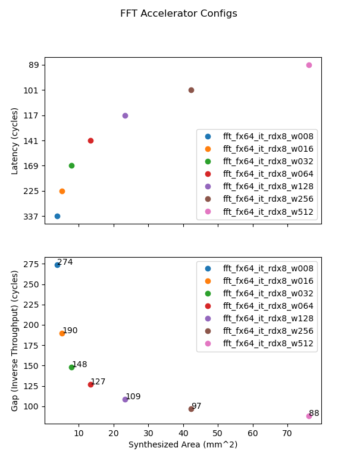

<p align="center">
  <a href="" rel="noopener">
 </a>
</p>

<h1 align="center">Research S23</h1>

<div align="center">

</div>

---

<p align="center"> Contact me if there is any confusion or would like to learn more
    <br> 
</p>
<p align="center"> Iescobar@andrew.cmu.edu
    <br> 
</p>

# 📝 Table of Contents

- [📝 Table of Contents](#-table-of-contents)
- [About](#about)
- [Required Software](#required-software)
- [Spiral, Cadence, and Performance Analysis](#spiral-cadence-and-performance-analysis)
  - [Design synthesizing](#design-synthesizing)
  - [Retrieving results](#retrieving-results)
    - [Matlabplotlib](#matlabplotlib)
    - [CSV files](#csv-files)
    - [Final results](#final-results)
  - [Library functions used](#library-functions-used)
    - [OS library](#os-library)
    - [CSV library](#csv-library)
- [Sum Of Products optimizations ](#sum-of-products-optimizations-)
  - [Findings](#findings)
  - [Deriving Sum Of Products](#deriving-sum-of-products)
    - [*Version 0*    SOP\_iter0.py](#version-0-sop_iter0py)
    - [*Version 1*    SOP\_iter1.py](#version-1-sop_iter1py)
  - [Building the ISCAS89 SOP file](#building-the-iscas89-sop-file)
  - [Conclusion](#conclusion)
  - [Library functions used](#library-functions-used-1)
    - [Pyeda](#pyeda)
    - [Sympy ](#sympy-)
    - [Cframe](#cframe)

# About<a name = "about"></a>

During this semester, I worked under Mckenzie van der Hagen in syntheziable RTL (Fast Fourier Transform/Discrete Fourier Transform applied) encrption schemes that can applied in larger scale computing systems and many other uses.

As I worked under Mckenzie, I would work on simulating and synthezing multiple designs given by
<i>[Spiral](https://pmilder.ece.stonybrook.edu/dftgen_adv/)</i>.
This process required the use of <i>Matplotlib, CSV managemtent, bash/python scripting, </i>and <i>Cadence toolset</i> as 
I would modify multiple tickle files, and make various result files digestable and accessible with spreadsheet graph representations.

Another research topic of interest that was looked upon was trascribing possibly used circuits into a Sum Of Products circuit. I would be provided ISCASS files to work on such circuit and boolean analyzation.
Such tools ranged from <i>[pyeda](https://pyeda.readthedocs.io/en/latest/), [sympy](https://www.sympy.org/en/index.html), </i> and CMU's <i> [Cframe](https://htmlpreview.github.io/?https://raw.githubusercontent.com/iescobar1/research_s23/master/SOP_analysis/cframe_src/cframe_html/intro.html).</i> This required alot of looking for possible, reliable boolean algebra libraries and multiple implementations
in rearranging the circuit in plausible implementations due to the gradilarity of the circuits.

# Required Software
- Cadence toolset
- gpdk
- pypy (optional)
- sympy
- pyeda
- python3.0
- matplotlib

# Spiral, Cadence, and Performance Analysis

## Design synthesizing

When synthesizing the designs, I was assigned to run the <i>[Spiral](https://pmilder.ece.stonybrook.edu/dftgen_adv/)</i> webpage to provide me with FFT/DFT circuits.
Initially, we did a initial test of a *fully streaming* architecture with a iterative but these did not hold as advantage. Therefore, I syntheized multiple versions of 
the *iterative* architecture.

*Side note: Because of the provided code not splitting up the testbench and circuit into 2 different files, I created a script ([fix_rtl.py](design_stuff/fix_rtl.py)) to automate those corrections as also change the testbench to dump a power file.

I would use [run_spiral0.py](design_stuff/run_spiral0.py) to run simulation and synthese for these portions. I would initalize my [rtl.args](spiral_testing_0/digital/gcd/verif/src/rtl.args)(for simulation) and [config.tcl](spiral_testing_0/digital/gcd/verif/src/rtl.args)(for synthesizing) test values to *insert_test* to allow for python automation. This python script would also dump selected result/report files into [saved_reports/](saved_reports) for easy access when parsing will be done.

<br />

## Retrieving results

When retireving the results, I would be required to look into Final Area, Final Time, Final Power* and Simulation Power.

*Side note: During the synthesizing portion, I was not able to get certain power reports due to the gpdk I was using at the time and the capabilities of the computers aswell.

I would traverse through all reports using some OS library functions, and parse the data into a data structure that I would transfer into a csv file for easy transportation.

### Matlabplotlib

I was provided some primary code for graphing the data that I would use as a general outline. I would just read from the produced CSV file I made to graph all the results in a nicely fashion. Look at [grapher.py](design_stuff/grapher.py) for more details.



**These results are not to be used outside of this program and are only an illustration
of what to expect from my current code structure**

*Thank Mckenzie for providing a outline helpful to synthesize the graph*

### CSV files

Down below are the libraries I used. Look at [parser.py](design_stuff/parser.py) for more details of parsing. The results should look like [results.csv](results.csv). And for the Google Sheet version, click [here](https://docs.google.com/spreadsheets/d/1Fyj-KPYSK6MaFwa9DmRD91LnzNpKH6pNq3ST01IPY_8/edit?usp=sharing) (personel only)

### Final results

In the end, I was able to provided the design graphs and pure data required as seen in the design even though there was alot of delay due to the machines not cooperating and Power reports taking way to long (1-3 days long for a single test). In the future, I would work with a better gdpk aswell as work with more varying tests.

<br />

## Library functions used

### OS library
links:
- [Python documentation](https://docs.python.org/3/library/os.html)
```
Used to traverse files AND do terminal input

    os.system(cmd) : void
        Parameter
        -----
        cmd : str
            a command that you want to enact in the terminal prompt

    os.walk(dir_name) : iter
        Generator type that traverses through every possible branch in the directory and its sub branches 
            all the way to the files
        Parameter
        ------
        dir_name : str
        

    os.chdir(new_path) : void
        changes your current working directory to new_path
        Parameter
        ------
        new_path : str
            working directory path    


    os.getcwd() : str
        Returns The current working directory
        
```
### CSV library
links:

- [python documentation](https://docs.python.org/3/library/csv.html)
- [realpython guide](https://realpython.com/python-csv/)
- [programiz guide](https://www.programiz.com/python-programming/csv)
```
    csv.writer(file_name) : csv.writer.type
        Makes a csv.writer type to use esential functions for writing into file
        Parameter 
        -----
        file_name : str

    csv.DictWriter(file_name ,fieldname=[] ) : csv.Dictwriter.type
        Makes a csv.dictWriter type for easily translating a dict into a csv file
        Parameter
        -----
        file_name : str
        
        fieldname : lis
            a list of strings containing each attribute you would line to record
            (this will be your first row)
        
    csv.writeheader() : void
        Required to making the file header (aka first row of the csv file)

    csv.writerows(result_list) : void
        Writes all the rows in the csv file
        *** for dictWriter type only ***
        result_list : list dict
            A list of dictionaries with keys equivilant to fieldNames as specified during instantiation
        
```


# Sum Of Products optimizations <a name="usage"></a>

When provided ISCAS89 files, I was tasked to turn the said circuit into a Sum Of Products circuit that was
the most simplified. This would be tested in further research to see how this can provide a utilization benefit
and further parallelization.

## Findings

- When using SymPy and Pyeda, they both seemed to have issues when it came to larger Inputs/variables.
One of these issues was that a recurssion bound is reach when simplifying, this bound is a normal
python constraint to prevent segfaults or undefined behavior. If we extended this limit, we do indeed achieve this seg_fault.

- Another issue is that expr() for sympy is not the most useful and shouldn't be used as it converts
strings to boolean expressions that are ill'y formated half the time or throws a error otherwise.

- I would recommend using pypy in the future for better speedup and computational usage. Pypy was used
  in the second half of the exploration and didn't have recursion limits from what I remember
- One famouse algorithm that might be of use in the future is the [Quine-McClusky Algorithm (wiki link)](https://en.wikipedia.org/wiki/Quine-McCluskey_algorithm) or the [expresso heuristic logic minimizer (wiki_link)](https://en.wikipedia.org/wiki/Espresso_heuristic_logic_minimizer). These are defintely useful and are used in these libraries aswell.

## Deriving Sum Of Products

When trying to derive the sum of products, I had 2 approaches which used a combination of the libraries
I found. If you read the [sum_of_products.py](SOP_analysis/sum_of_products.py), there should be a parameter to choose between the 2 versions called *use_version_0*

### *Version 0* &nbsp;&nbsp;&nbsp;[SOP_iter0.py](SOP_analysis/SOP_iter0.py)

During my first approach, I decided to use cframe to iterate through all the possible input sequences
and record each output thats value held true. This would create a data structure of unsimplified Sum Of Products intutively.
The only problem left is to simplify repition or unnecesary logic.

I would use *SymPy* SOPform() to format it into a easily parsable expression then string. Before I used to use Simplify from
the sympy library but that did not prove benefical after 8 input expressions. Therefore no simplifications are technically done in the currently commited code.

### *Version 1* &nbsp;&nbsp;&nbsp;[SOP_iter1.py](SOP_analysis/SOP_iter1.py)

During my second approach, I decided that deriving a boolean expression first might be more cost efficenty
during simplification. Therefore, for this route, I decided to iterate through all the circuits outputs
and record a string illustrating the boolean expression. 

Once I have the boolean expression, I would use
to_dnf() from the *Pyeda* library and convert the expression to a SOP. This would naturally be simplified
unless it was a large amount of inputs. At this point, I could also use *SymPy's* dnf() function aswell
but this won't prove helpful as it does the same thing if not worse (later explained in findings).

## Building the ISCAS89 SOP file

In the writer file, [ISCASS_WRITER.py](SOP_analysis/ISCASS_writer.py), I take a boolean expression
that is given to us and write it into a file script. The boolean expression MUST be in a sumOfProducts
format for iterative purposes. This function resursivly makes a string reading the sumOfProducts expression
with in-order Traversal of each of the subexpressions.

As we make the circuit, one problem we have is repetivitive logic, This is taken into consideration by having a dict holding all the history of gates made called *and_gate_his* and *or_gate_his*.

## Conclusion

There can definitely be more work done in the boolean expression simplification without the large
dependcy. The use of a cpp file that does the boolean simplification would be the most logical route. 
The SOP simplification files would be no more but we would use a similar ISCASS_writer.py file to
synthesize the code.

Overall, it was very fustrating how uncooperative some of the libraries and tools were for larger circuits but they were still of some use in smaller scales.

## Library functions used

### Pyeda
links:
- [boolean library](https://pyeda.readthedocs.io/en/latest/expr.html)
- [minimization library](https://pyeda.readthedocs.io/en/latest/2llm.html?highlight=espresso#minimize-boolean-expressions)

For version 1
```
expr(string_expression) : pyeda.expression
    parameters
    -----
    string_expression : str
        a representation of a boolean expression
        (e.g "a | (b&c)") 

expression.to_dnf() : pyeda.expression
    For a valid pyeda.expression, conver it to a SOP.
        This should simplify the expression unless the expression has a large 
        range of inputs

```

### Sympy <a name = "deployment"></a>
links:
- [SymPy's logic library 1.11](https://docs.sympy.org/latest/modules/logic.html)
- [Sympy's logic library 0.7.4](https://omz-software.com/pythonista/sympy/modules/logic.html)
- [GeekForGeek SymPy usage](https://www.geeksforgeeks.org/what-are-the-logical-expressions-in-sympy/)


For version 1

```
to_dnf(expr, simplify=False, force=False ) : sympy.expr
    For a valid pyeda.expression, conver it to a SOP.
    parameters
    -----
    expr : str
        boolean expression
    simplify : bool
        Toggle for the most simplified to be synthesized (8 input limited)
    force : bool
        Toggle to remove simplification limitations

parse_expr(string_expresion) : sympy.expr
    Returns a an sympy expression from the older version of sympy.
    (e.g. "or( and(a, not('var', b))))")
    NOTE: this function is unstable as it can not convert valid 
        boolean expressions
```
For Version 0
```
SOPform(variables, minterms ) : sympy.expr
    Finds the boolean map (completely unsimplified SOP)
    parameters
    -----
    variables : list of strings
        input variables
    minterms : 2D array of 1s and 0s
        this sub list represents a minterm for the expression
    
simpify_logic(expr, form=None, force= False) : sympy.expr
    Finds most simplfied expression
    parameters
    ---
    expr : sympy.expr
        representation of the 

```

### Cframe
links:
- [Documentation](https://htmlpreview.github.io/?https://raw.githubusercontent.com/iescobar1/research_s23/master/SOP_analysis/cframe_src/cframe_html/cframe.html)

```
circuit.evaluate()

circuit.inputs

circuit.outputs

circuit.gatemap

gate.gatetype

gate.fanin

gate.name

cf.roth

```